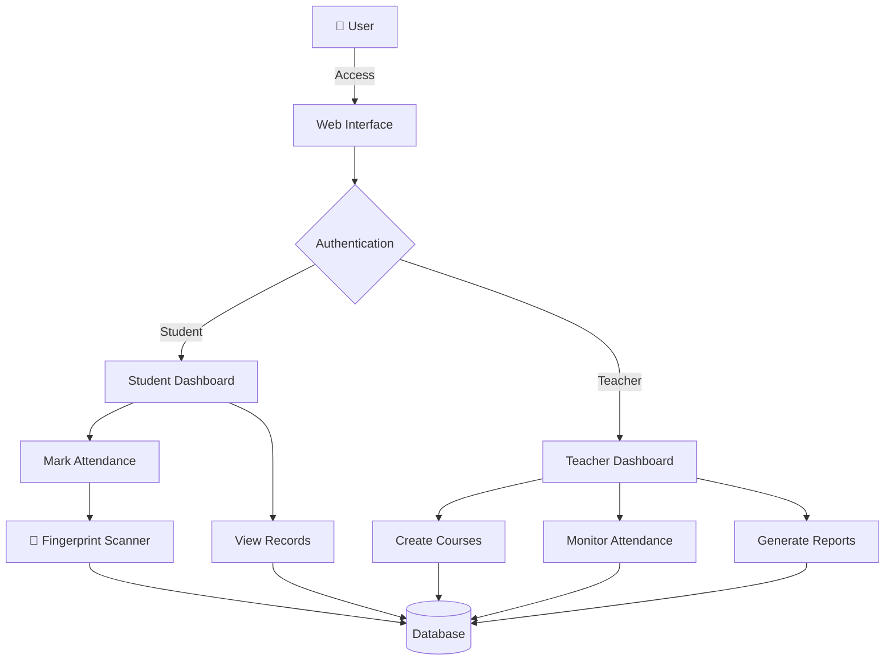

<div align="center">

# 🔐 Biometric Attendance Management System

**Secure Attendance Tracking • Biometric Authentication • Real-time Monitoring • Student & Teacher Portal**

[](https://www.php.net/)
[](https://www.mysql.com/)
[](https://getbootstrap.com/)
[](https://www.javascript.com/)

[](LICENSE)
[](https://github.com/avishek-sarkar/Biometric-Attendance-System)
[](http://makeapullrequest.com)

---

### 🎯 Simplifying attendance tracking with secure biometric authentication

</div>

---

## 📋 Table of Contents

- [✨ Features](#-features)
- [🏗️ System Architecture](#️-system-architecture)
- [🚀 Getting Started](#-getting-started)
  - [Prerequisites](#prerequisites)
  - [Installation](#installation)
- [💻 Technology Stack](#-technology-stack)
- [📁 Project Structure](#-project-structure)
- [🎓 User Roles](#-user-roles)
- [🔒 Security Features](#-security-features)
- [🤝 Contributing](#-contributing)
- [👨‍💻 Developers](#-developers)
- [📄 License](#-license)
- [📧 Contact](#-contact)

---

## ✨ Features

<div align="center">

| Feature | Description |
|---------|-------------|
| 🔐 **Biometric Authentication** | Secure fingerprint-based attendance marking |
| 👨‍🎓 **Student Portal** | Easy registration and attendance tracking |
| 👨‍🏫 **Teacher Dashboard** | Comprehensive attendance management and monitoring |
| 📧 **Email Verification** | Secure account verification via email |
| 📊 **Real-time Reports** | Instant attendance statistics and analytics |
| 🔄 **Automated Sync** | Seamless data synchronization with hardware |
| 🔒 **Password Security** | Encrypted passwords and secure password reset |
| 📱 **Responsive Design** | Mobile-friendly interface using Bootstrap 5 |

</div>

### Key Highlights

- ✅ **No Proxy Attendance** - Biometric verification prevents fraudulent attendance
- ✅ **Quick Registration** - Simple and fast student/teacher registration process
- ✅ **Automated Tracking** - Real-time attendance recording with timestamps
- ✅ **Email Notifications** - Automated email alerts for registration and verification
- ✅ **Course Management** - Create and manage multiple courses efficiently
- ✅ **Attendance History** - Complete attendance records with date-wise tracking
- ✅ **Secure Access** - Role-based authentication system
- ✅ **Hardware Integration** - ESP-based fingerprint sensor integration

---

## 🏗️ System Architecture



### Workflow

1. **Registration Phase**
   - Student/Teacher creates account
   - Email verification sent
   - Account activated upon verification
   - Fingerprint enrollment (students only)

2. **Attendance Marking**
   - Student scans fingerprint on device
   - System validates fingerprint ID
   - Attendance recorded with timestamp
   - Data synced to database

3. **Monitoring Phase**
   - Teachers view real-time attendance
   - Generate course-wise reports
   - Export attendance data
   - Manage student records

---

## 🚀 Getting Started

### Prerequisites

Before you begin, ensure you have the following installed:

- **PHP** >= 7.4
- **MySQL** >= 5.7 or **MariaDB** >= 10.4
- **Apache/Nginx** Web Server
- **XAMPP/WAMP/LAMP** (Recommended for local development)
- **Web Browser** (Chrome, Firefox, Safari, Edge)
- **Fingerprint Scanner** (ESP-based module for biometric features)

### Installation

#### 1️⃣ Clone the Repository

```bash
git clone https://github.com/avishek-sarkar/Biometric-Attendance-System.git
cd Biometric-Attendance-System
```

#### 2️⃣ Database Setup

**Option A: Using phpMyAdmin**

1. Open phpMyAdmin in your browser
2. Create a new database named `attendancesystem`
3. Import the SQL file: `models/attendancesystem.sql`

**Option B: Using MySQL Command Line**

```bash
mysql -u root -p
```

```sql
CREATE DATABASE attendancesystem;
USE attendancesystem;
SOURCE models/attendancesystem.sql;
EXIT;
```

#### 3️⃣ Configure Database Connection

Edit `config/db_config.php` with your database credentials:

```php
<?php
$host = 'localhost';
$dbname = 'attendancesystem';
$username = 'your_username';  // Default: root
$password = 'your_password';  // Default: empty

$conn = new mysqli($host, $username, $password, $dbname);

if ($conn->connect_error) {
    die("Connection failed: " . $conn->connect_error);
}
?>
```

#### 4️⃣ Email Configuration

Configure email settings in the mail controller for verification emails:

1. Navigate to `controllers/send_mail.php`
2. Update SMTP settings with your email credentials

```php
$mail->Host = 'smtp.gmail.com';
$mail->Username = 'your-email@gmail.com';
$mail->Password = 'your-app-password';
$mail->Port = 587;
```

> **Note:** For Gmail, you need to enable "Less secure app access" or use App Passwords.

#### 5️⃣ Start the Application

**Using XAMPP:**

1. Copy the project folder to `htdocs` directory
2. Start Apache and MySQL from XAMPP Control Panel
3. Open browser and navigate to: `http://localhost/Biometric-Attendance-System`

**Using PHP Built-in Server:**

```bash
php -S localhost:8000
```

Then open: `http://localhost:8000`

#### 6️⃣ Hardware Setup (Optional)

For fingerprint scanner integration:

1. Connect ESP-based fingerprint module
2. Configure the ESP to connect to your network
3. Update the ESP endpoint in `controllers/attendance_esp.php`
4. Ensure the hardware can communicate with the server

---

## 💻 Technology Stack

<div align="center">

### Frontend


### Backend


### Libraries & Tools

- **PHPMailer** - Email sending functionality
- **Bootstrap Icons** - Icon library
- **ESP32/ESP8266** - Hardware integration for fingerprint scanner

</div>

---

## 📁 Project Structure

```
Biometric-Attendance-System/
│
├── 📂 config/                  # Configuration files
│   ├── db_config.php          # Database configuration
│   └── README.md
│
├── 📂 controllers/            # Business logic controllers
│   ├── PHPMailer/            # Email library
│   ├── login.php             # Student login handler
│   ├── teacher_login.php     # Teacher login handler
│   ├── attendance_esp.php    # Hardware integration
│   ├── send_mail.php         # Email sending logic
│   ├── transfer_data.php     # Data synchronization
│   └── ... (other controllers)
│
├── 📂 models/                 # Database schemas
│   ├── attendancesystem.sql  # Main database schema
│   └── MainDb.sql            # Database creation script
│
├── 📂 views/                  # User interface pages
│   ├── login_form.php         # Login page
│   ├── registerForm.html     # Student registration
│   ├── student_dashboard.php # Student dashboard
│   ├── teacher_dashboard.php # Teacher dashboard
│   ├── fingerprint_scan.php  # Fingerprint enrollment
│   └── ... (other views)
│
├── 📂 core/                   # Core functionality
│   └── authentication.php     # Authentication logic
│
├── 📂 includes/               # Reusable components
│   ├── navbar.php            # Navigation bar
│   └── footer.php            # Footer
│
├── 📂 public/                 # Public assets
│   ├── 📂 css/               # Stylesheets
│   ├── 📂 js/                # JavaScript files
│   └── 📂 images/            # Images and media
│
├── index.php                  # Home page
├── DeveloperInfo.php          # Developer information
└── README.md                  # Project documentation
```

---

## 🎓 User Roles

### 👨‍🎓 Student

- Register with personal and academic details
- Verify email address
- Enroll fingerprint for attendance
- Mark attendance using fingerprint scanner
- View personal attendance records
- Track attendance percentage
- Update profile information
- Reset password

### 👨‍🏫 Teacher

- Register with professional credentials
- Create and manage courses
- Add students to courses
- Monitor real-time attendance
- Generate attendance reports
- View student-wise statistics
- Export attendance data
- Manage course settings

---

## 🔒 Security Features

- 🔐 **Password Hashing** - Bcrypt encryption for all passwords
- 🔑 **Session Management** - Secure PHP session handling
- ✉️ **Email Verification** - Two-factor verification via email
- 🛡️ **SQL Injection Prevention** - Prepared statements and parameterized queries
- 🚫 **XSS Protection** - Input sanitization and output encoding
- 🔒 **CSRF Protection** - Token-based form validation
- 👤 **Role-Based Access** - Separate authentication for students and teachers
- ⏱️ **Session Timeout** - Automatic logout after inactivity
- 🔄 **Password Reset** - Secure password recovery mechanism
- 📝 **Audit Logs** - Attendance records with timestamps

---

## 🤝 Contributing

We welcome contributions! Here's how you can help:

### How to Contribute

1. **Fork the Repository**
   ```bash
   git clone https://github.com/avishek-sarkar/Biometric-Attendance-System.git
   ```

2. **Create a Feature Branch**
   ```bash
   git checkout -b feature/AmazingFeature
   ```

3. **Make Your Changes**
   - Write clean, documented code
   - Follow existing code style
   - Test your changes thoroughly

4. **Commit Your Changes**
   ```bash
   git commit -m 'Add some AmazingFeature'
   ```

5. **Push to the Branch**
   ```bash
   git push origin feature/AmazingFeature
   ```

6. **Open a Pull Request**
   - Provide a clear description of changes
   - Link any relevant issues
   - Wait for review

### Contribution Guidelines

- ✅ Follow PSR-12 coding standards for PHP
- ✅ Write meaningful commit messages
- ✅ Update documentation for new features
- ✅ Add comments for complex logic
- ✅ Test on multiple browsers
- ✅ Ensure responsive design
- ✅ No breaking changes without discussion

---

## 👨‍💻 Developers

<div align="center">

### 🌟 Meet the Team

<table>
  <tr>
    <td align="center">
      
      <br />
      <sub><b>Avishek Sarkar</b></sub>
      <br />
      <sub>Roll: 21102035</sub>
      <br />
      <sub>Reg: 9902</sub>
      <br />
      <sub>📧 avishek1416@gmail.com</sub>
    </td>
    <td align="center">
      
      <br />
      <sub><b>Prantic Paul</b></sub>
      <br />
      <sub>Roll: 21102042</sub>
      <br />
      <sub>Reg: 9909</sub>
      <br />
      <sub>📧 pranticshimul@gmail.com</sub>
    </td>
  </tr>
  <tr>
    <td align="center">
      
      <br />
      <sub><b>Md. Tuhin</b></sub>
      <br />
      <sub>Roll: 21102021</sub>
      <br />
      <sub>Reg: 9888</sub>
      <br />
      <sub>📧 mdtuhin1499@gmail.com</sub>
    </td>
    <td align="center">
      
      <br />
      <sub><b>Zinnia Tasnim Rifat</b></sub>
      <br />
      <sub>Roll: 21102004</sub>
      <br />
      <sub>Reg: 9871</sub>
      <br />
      <sub>📧 zinnia660@gmail.com</sub>
    </td>
  </tr>
</table>

**Session:** 2020-2021  
**Institution:** Department of Computer Science & Engineering, JKKNIU

</div>

---

## 📄 License

This project is licensed under the MIT License - see the [LICENSE](LICENSE) file for details.

---

## 📧 Contact

<div align="center">

### Get in Touch

Have questions or suggestions? Reach out to us!

[](https://github.com/avishek-sarkar/Biometric-Attendance-System)
[](mailto:avishek1416@gmail.com)

**Repository:** [Biometric-Attendance-System](https://github.com/avishek-sarkar/Biometric-Attendance-System)

</div>

---

<div align="center">

### ⭐ If you find this project useful, please give it a star!

**Thank you for visiting! Happy Coding! 🚀**

**Secure Attendance, Smart Future 🔐**

**Made with ❤️ by a team of Noobs**

---

*Last Updated: November 2025*

</div>
