# Biometric Attendance Management System

## Project Overview
The Biometric Attendance Management System is a comprehensive, IoT-based web application designed to fully automate and secure the process of recording attendance. By seamlessly integrating biometric hardware (fingerprint sensors) with a cloud-connected web interface, this system provides educational institutions with a reliable, scalable, and highly accurate solution for daily attendance tracking.

## Why It Matters
Traditional manual attendance systems relying on paper logs or ID cards are highly vulnerable to inefficiencies, errors, and time fraud. This system directly solves these challenges by:

* **Eliminating Proxy Attendance:** Biometric verification ensures that a student must be physically present to mark their attendance.
* **Reducing Administrative Burden:** Automating the tracking process saves teachers valuable time, allowing them to focus entirely on instruction rather than manual record-keeping.
* **Enhancing Data Security:** Centralized database storage eliminates the risk of lost or tampered physical records.
* **Providing Real-Time Insights:** Administrators and teachers can instantly monitor attendance logs, track statistics, and generate automated reports.

## Technology Stack

**Frontend**
* HTML5, CSS3, JavaScript (Vanilla)
* Bootstrap 5 Framework

**Backend & Database**
* PHP (Raw)
* MySQL

**Hardware (IoT)**
* **Microcontroller:** ESP8266 (with built-in Wi-Fi)
* **Biometric:** R307 Fingerprint Sensor (UART communication)
* **Display & Feedback:** 16x2 LCD Display (I2C), LEDs (Status indicators), Buzzer (Audio alerts)
* **Power & Control:** 5V Power Supply / Battery, Physical Switches

## System Architecture and Workflow

The system bridges physical hardware with a centralized web application. Students and teachers interact with their respective dashboards, while the hardware node handles the physical authentication and syncs real-time data to the server.

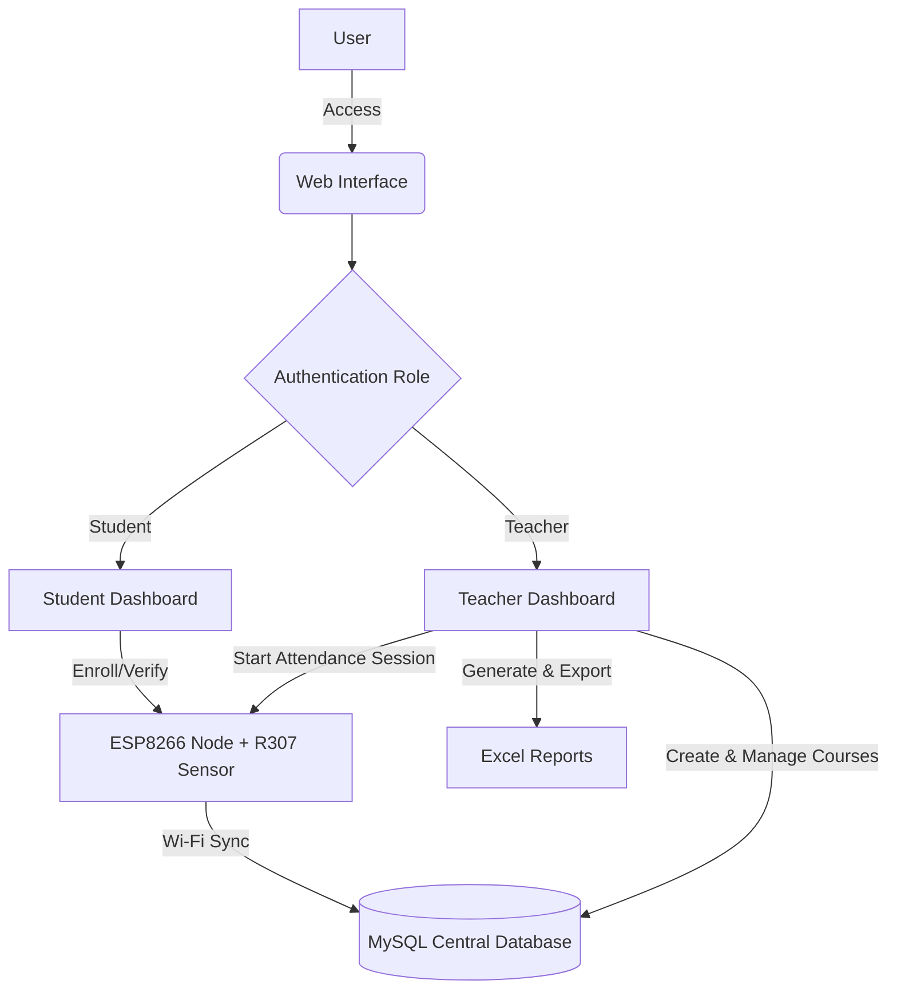
```mermaid
graph TD
    A[User] -->|Access| B(Web Interface)
    B --> C{Authentication Role}
    C -->|Student| D[Student Dashboard]
    C -->|Teacher| E[Teacher Dashboard]
    
    D -->|Enroll/Verify| F[ESP8266 Node + R307 Sensor]
    F -->|Wi-Fi Sync| G[(MySQL Central Database)]
    
    E -->|Create & Manage Courses| G
    E -->|Start Attendance Session| F
    E -->|Generate & Export| H[Excel Reports]
```

## Database Schema

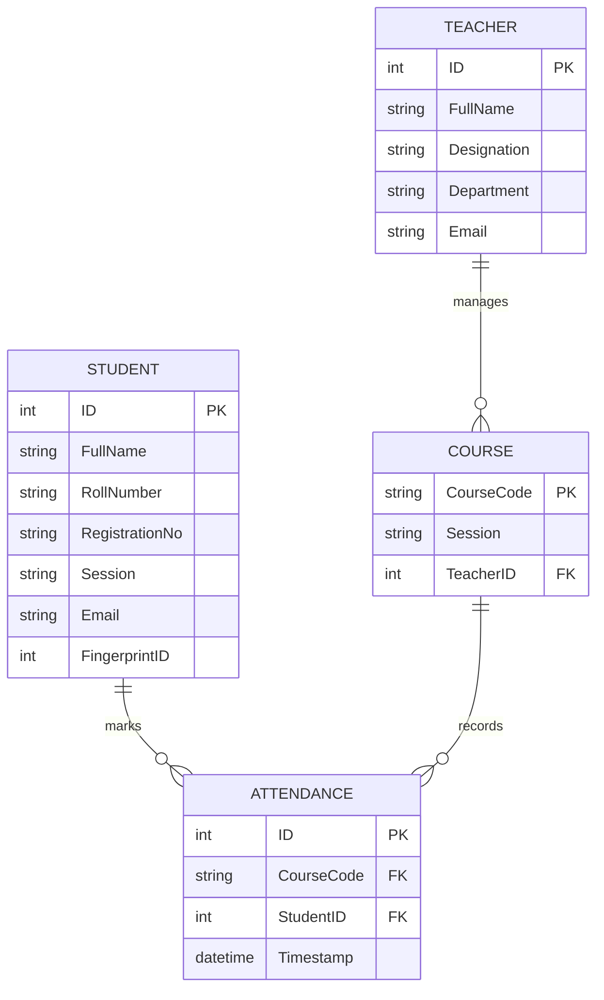
```mermaid
erDiagram
    STUDENT ||--o{ ATTENDANCE : "marks"
    TEACHER ||--o{ COURSE : "manages"
    COURSE ||--o{ ATTENDANCE : "records"
    
    STUDENT {
        int ID PK
        string FullName
        string RollNumber
        string RegistrationNo
        string Session
        string Email
        int FingerprintID
    }
    
    TEACHER {
        int ID PK
        string FullName
        string Designation
        string Department
        string Email
    }
    
    COURSE {
        string CourseCode PK
        string Session
        int TeacherID FK
    }
    
    ATTENDANCE {
        int ID PK
        string CourseCode FK
        int StudentID FK
        datetime Timestamp
    }
```

## Key Capabilities and Features

- **Strict Biometric Authentication:** Utilizes the R307 sensor for secure, spoof-resistant physical presence tracking.

- **Dedicated Role Portals:** Isolated and secure dashboards tailored specifically for Students and Teachers.

- **Email Verification:** Automated email alerts (via PHPMailer) ensure secure account registration.

- **Advanced Course Management:** Teachers can dynamically create courses, start attendance timers, and automatically generate end-of-course Excel attendance sheets.

- **Hardware Audio-Visual Feedback:** The physical scanner features an LCD display, multi-color LEDs, and buzzers to provide instant confirmation of successful or failed attendance attempts.

### System Showcase (Demo)

| Hardware Front view | Hardware Side View | Hardware Back View |
| :---: | :---: | :---: |
| 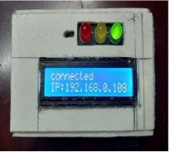 | 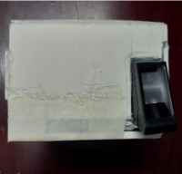 | 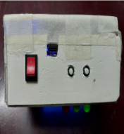 |

| Home Page |
| :---: |
| 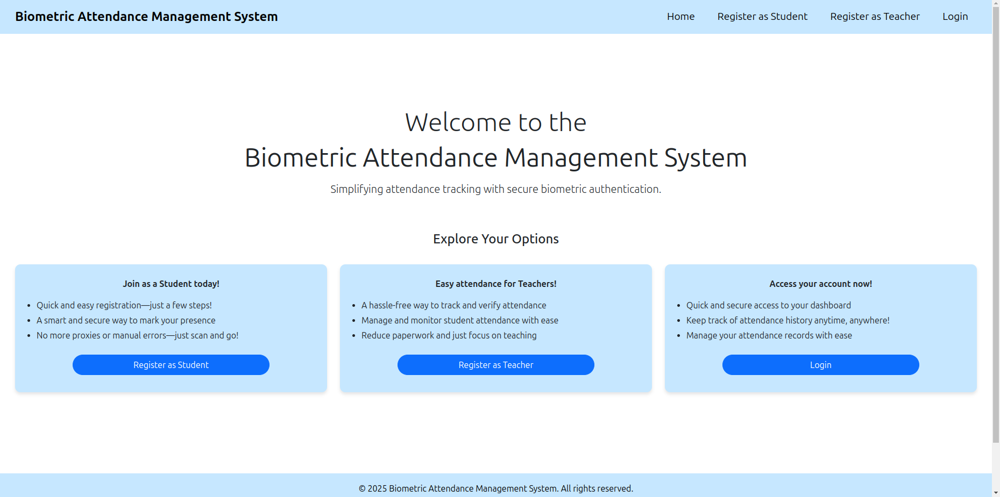 |

| Authentication |
| :---: |
| 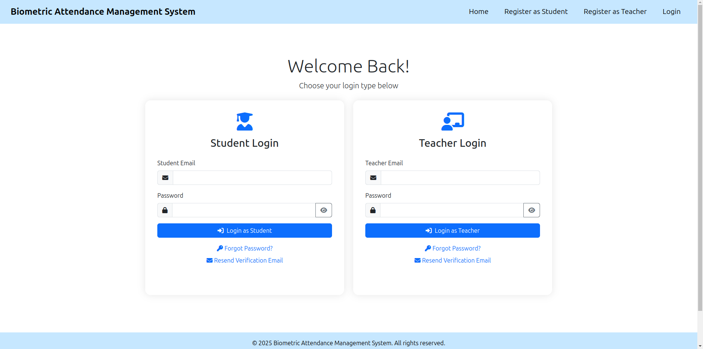 |

| Teacher Registration Portal |
| :---: |
| 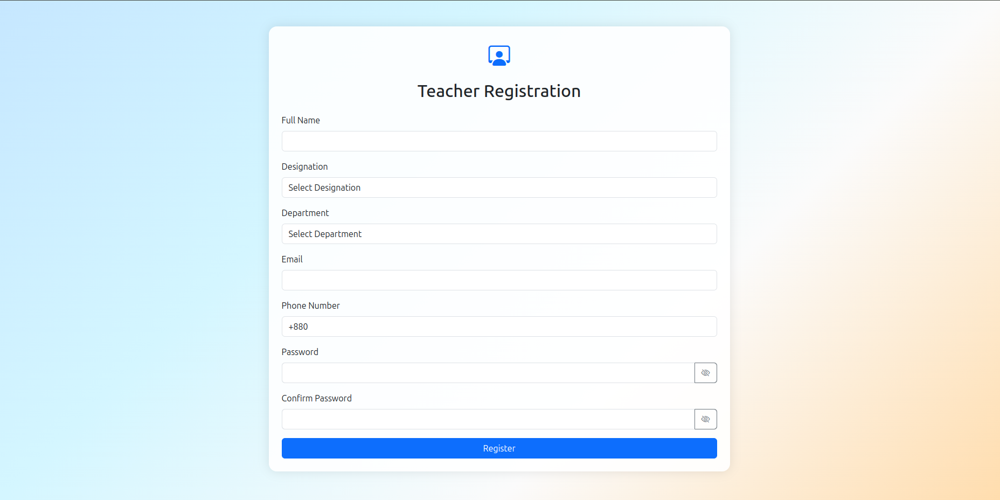 |

| Fingerprint Registration |
| :---: |
| 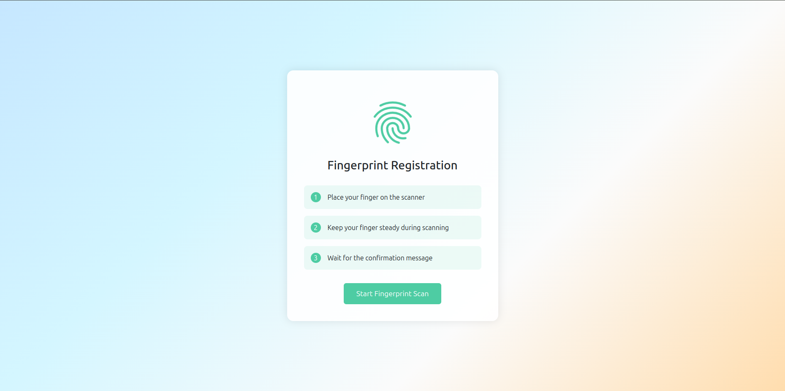|

| Student Dashboard |
| :---: |
| 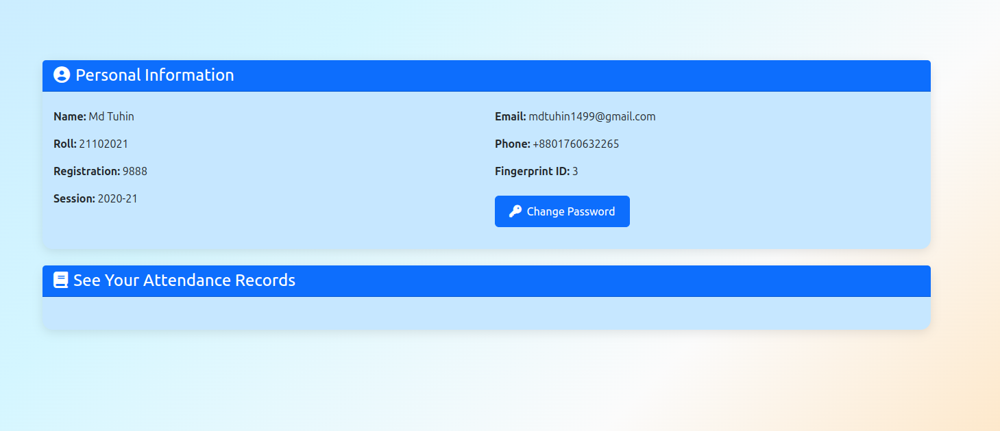 |

| Course Administration |
| :---: |
| 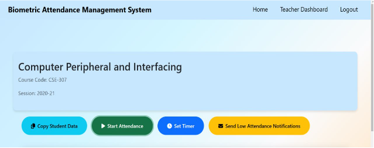 |

## Installation and Setup

### Prerequisites
* **PHP** >= 7.4
* **MySQL** >= 5.7 or **MariaDB** >= 10.4
* **Web Server:** Apache/Nginx (XAMPP/WAMP recommended for local development)
* **Hardware:** ESP8266 and R307 Fingerprint Sensor

### Setup Steps

#### 1. Clone the Repository

```bash
git clone https://github.com/your-username/Biometric-Attendance-System.git
cd Biometric-Attendance-System
```

#### 2. Database Configuration

1. Create a MySQL database named `attendancesystem`.
2. Import the SQL schema located at:

   ```text
   models/attendancesystem.sql
   ```

3. Update the database credentials in:

   ```text
   config/db_config.php
   ```

#### 3. Email Configuration

1. Open:

   ```text
   controllers/send_mail.php
   ```

2. Configure the following SMTP settings:

   - Host
   - Username
   - App Password
   - Port

3. Save the file after updating your email credentials.

#### 4. Hardware Node Setup

1. Connect the ESP8266 with:
   - R307 Fingerprint Sensor
   - LCD Display
   - LEDs
   - Buzzer

2. Follow the hardware wiring diagram used in the project.

3. Update the API endpoint URLs in the ESP8266 firmware.

   Example:

   ```text
   controllers/attendance_esp.php
   ```

#### 5. Launch the Application

1. Start Apache and MySQL services.
2. Open your browser and navigate to:

   ```text
   http://localhost/Biometric-Attendance-System
   ```

3. The system is now ready for fingerprint enrollment and attendance tracking.

## Project Structure

```
Biometric-Attendance-System/
│
├── config/                   # Configuration files
│   ├── db_config.php         # Database configuration
│   └── README.md
│
├── controllers/              # Business logic controllers
│   ├── PHPMailer/            # Email library
│   ├── login.php             # Student login handler
│   ├── teacher_login.php     # Teacher login handler
│   ├── attendance_esp.php    # Hardware integration
│   ├── send_mail.php         # Email sending logic
│   ├── transfer_data.php     # Data synchronization
│   └── ... (other controllers)
│
├── models/                   # Database schemas
│   ├── attendancesystem.sql  # Main database schema
│   └── MainDb.sql            # Database creation script
│
├── views/                    # User interface pages
│   ├── login_form.php        # Login page
│   ├── registerForm.html     # Student registration
│   ├── student_dashboard.php # Student dashboard
│   ├── teacher_dashboard.php # Teacher dashboard
│   ├── fingerprint_scan.php  # Fingerprint enrollment
│   └── ... (other views)
│
├── core/                     # Core functionality
│   └── authentication.php    # Authentication logic
│
├── includes/                 # Reusable components
│   ├── navbar.php            # Navigation bar
│   └── footer.php            # Footer
│
├── public/                   # Public assets
│   ├── css/                  # Stylesheets
│   ├── js/                   # JavaScript files
│   └── images/               # Images and media
│
├── index.php                 # Home page
├── DeveloperInfo.php         # Developer information
├── documentation             # Project documentation
└── README.md                 # Project documentation
```

## Future Enhancements

- Replace the current optical fingerprint sensor with a capacitive sensor to improve biometric accuracy and security.

- Store fingerprint templates in hexadecimal format to support multiple attendance devices using a centralized database.

- Allow teachers to start and stop attendance sessions directly from the fingerprint scanner.

- Implement offline queuing and synchronization mechanisms to prevent data loss during network interruptions.

- Add attendance insights, reporting tools, and trend visualization features.

## Developer Information


## Closing Remarks

Thank you for exploring the **Biometric Attendance Management System**.

This project demonstrates the integration of biometric authentication, IoT hardware, and web technologies to provide a secure, automated, and reliable attendance management solution. By eliminating proxy attendance and streamlining record management, the system addresses real-world challenges faced by educational institutions. Feel free to explore the codebase, fork the repository, and contribute ideas for future improvements.

---
